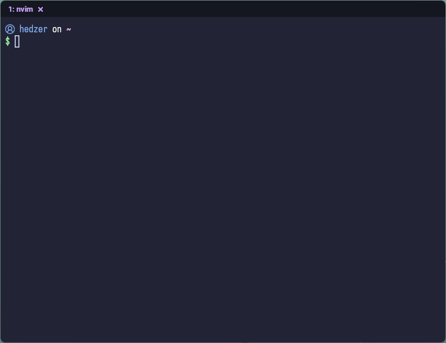

> [!IMPORTANT]
> I decided to try wezterm and currently using it as main terminal

---

# wezterm

### Modifications:
- Just a copy of https://www.youtube.com/watch?v=V1X4WQTaxrc tailored for me :p
